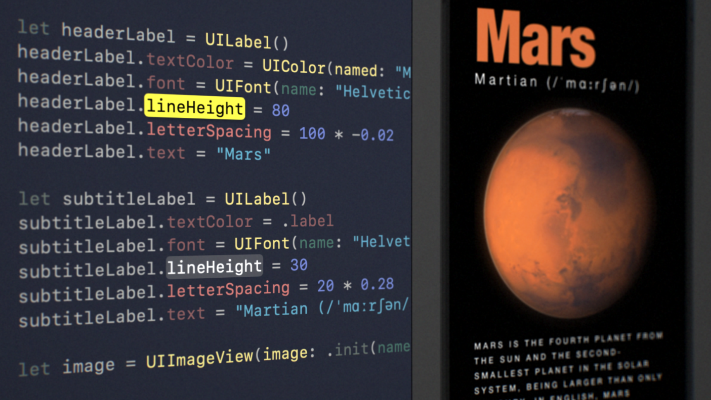
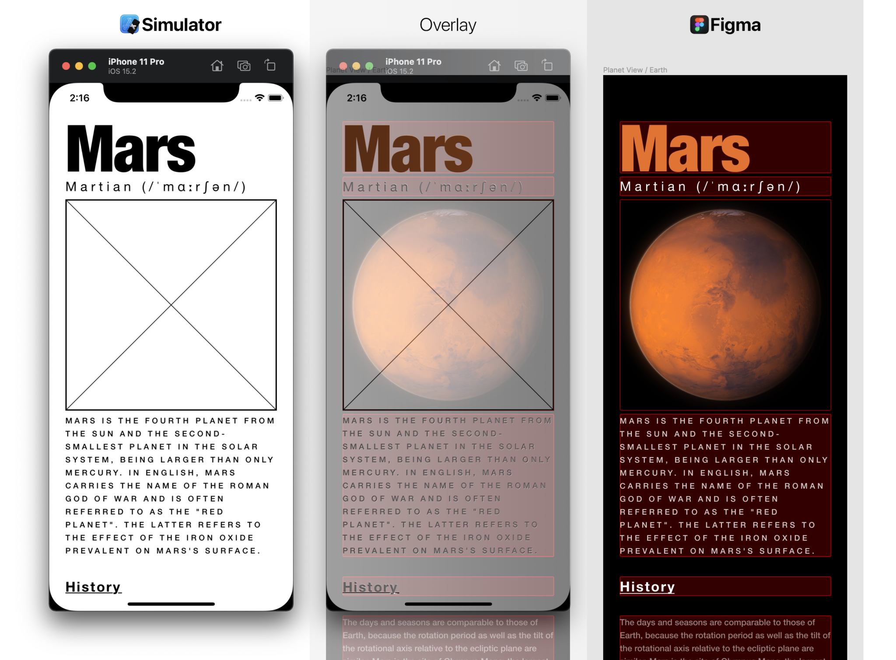
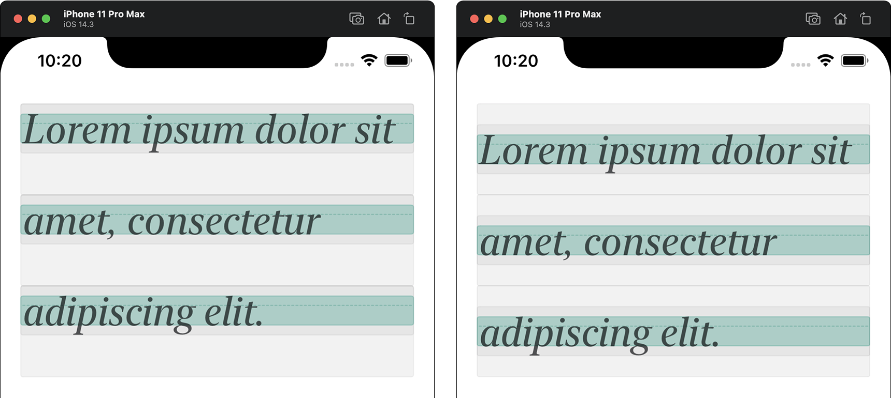
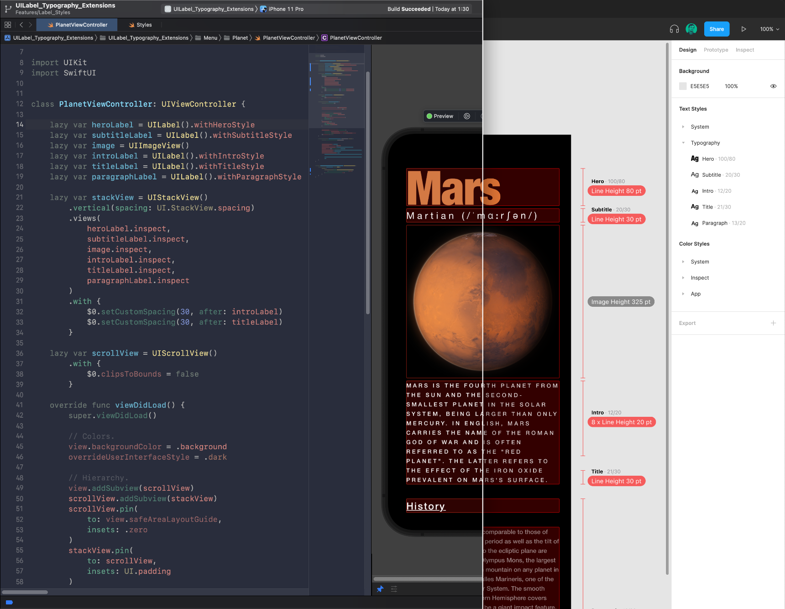

# UILabel Typography Extensions 📐
Set `UILabel` line height, letter spacing (and more).

```Swift
let headerLabel = UILabel()
headerLabel.textColor = UIColor(named: "Mars")
headerLabel.font = UIFont(name: "HelveticaNeue-CondensedBlack", size: 100)
headerLabel.lineHeight = 80
headerLabel.letterSpacing = 100 * -0.02
headerLabel.text = "Mars"
```

<p align="center"></p>

See the complementary article at [**UILabel line height, letter spacing and more** UILabel typography extensions].

<p align="center"></p>

## How it works

It is an extension on `UILabel` that adds some typographic properties using [**Objective-C Runtime**] (for stored properties on a Swift extension), [`NSAttributedString`] (for manage typographic properties), and [`NSKeyValueObservation`] (to be able to use the regular `text` property to manage text content).

<p align="center"></p>

It also takes care of `baselineOffset` values to keep the text content in the vertical center (right). By default, `NSAttributedString` sticks multiline label content to the top of the container view (left), which makes it hard to 
match the UI with the design specifications.

<p align="center"></p>

Using this extension you can build screens that 100% match design specifications. More on that in the article at [**UILabel line height, letter spacing and more** UILabel typography extensions].


## License

> Licensed under the [**MIT License**](https://en.wikipedia.org/wiki/MIT_License).

[**Objective-C Runtime**]: https://developer.apple.com/documentation/objectivec/objective-c_runtime
[`NSAttributedString`]: https://developer.apple.com/documentation/foundation/nsattributedstring
[`NSKeyValueObservation`]: https://developer.apple.com/documentation/foundation/nskeyvalueobservation
[**UILabel line height, letter spacing and more** UILabel typography extensions]: http://blog.eppz.eu/uilabel-line-height-letter-spacing-and-more-uilabel-typography-extensions/
